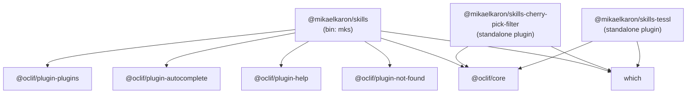
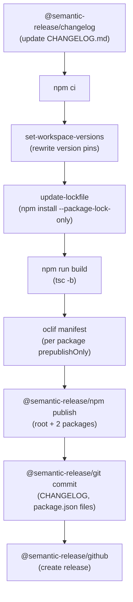
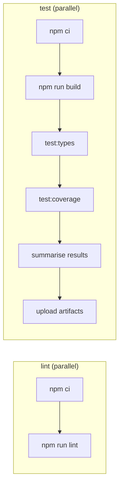

<!-- generated-by: gsd-doc-writer -->

# Architecture

## System Overview

`@mikaelkaron/skills` is an npm-workspace monorepo that ships a CLI tool (`mks`) built on the [oclif](https://oclif.io) framework. The CLI provides two capabilities: automating filtered git cherry-pick workflows and managing [tessl](https://tessl.io) skill tiles for installed oclif plugins. The root package acts as the distributed executable that bundles both capabilities through oclif's plugin system; the individual feature packages are also published independently so they can be installed as standalone plugins.

---

## Monorepo Structure

```
skills/
├── bin/                        # Root CLI entry point (mks)
├── packages/
│   ├── cherry-pick-filter/     # cherry-pick-filter plugin package
│   └── tessl/                  # tessl tile management plugin package
├── scripts/                    # Release and CI utility scripts
│   ├── lib/                    # Shared workspace/version helpers
│   └── reporters/              # Custom Node.js test reporter
├── skills/                     # Tessl tile definitions (one per package)
│   ├── cherry-pick-filter/
│   ├── cli/
│   └── tessl/
├── test/                       # Root-level integration/config tests
├── tsconfig.json               # TypeScript project references root
├── release.config.mjs          # Semantic-release configuration
├── oxlint.config.ts            # Linter configuration
└── oxfmt.config.ts             # Formatter configuration
```

The `packages/*` glob is declared as the npm workspaces entry. All packages share a single `node_modules` tree hoisted at the root.

---

## Package Responsibilities

### Root (`@mikaelkaron/skills`)

The root package is the primary published distribution. Its `bin/run.js` entry point delegates to `@oclif/core`'s `execute()` loader, which discovers plugins declared in the `oclif` section of `package.json`. The root oclif config lists `@oclif/plugin-help`, `@oclif/plugin-autocomplete`, `@oclif/plugin-not-found`, and `@oclif/plugin-plugins` as core plugins.

The root package does **not** contain its own commands. All commands are contributed by plugins.

### `packages/cherry-pick-filter` (`@mikaelkaron/skills-cherry-pick-filter`)

Provides the `cherry-pick-filter` command. The command syncs a working branch to a clean target branch by:

1. Collecting commits on `HEAD` not yet on the target branch that do not touch filtered path prefixes.
2. Detecting "mixed" commits — commits where some files are inside a filter prefix and some are outside — and halting with remediation instructions.
3. Checking out the target branch and applying commits in order via `git cherry-pick`.

All human-readable output goes to stderr; picked commit SHAs are emitted to stdout only when stdout is not a TTY, enabling pipe composition.

Internal layout:

```
src/
├── commands/
│   └── cherry-pick-filter.ts   # Command implementation
└── lib/
    └── git.ts                  # Thin spawnSync wrappers around git subcommands
```

### `packages/tessl` (`@mikaelkaron/skills-tessl`)

Provides the `tessl install`, `tessl list`, and `tessl uninstall` commands. These commands act as oclif-aware wrappers around the external `tessl` CLI binary. They look up installed plugins by their `oclif.id`, read the `tessl.tile` and `tessl.version` fields from each plugin's `package.json`, and delegate to the `tessl` binary with the resolved tile reference.

Installed tile state is tracked in a `tiles.json` file written to `oclif`'s `dataDir` (overridable via `TESSL_STATE_DIR`). The `tessl` binary location can be overridden via `TESSL_CMD`.

Internal layout:

```
src/
├── commands/tessl/
│   ├── install.ts              # tessl install <plugin…>
│   ├── list.ts                 # tessl list [plugin…]
│   └── uninstall.ts            # tessl uninstall <plugin…>
└── lib/
    ├── tessl.ts                # spawnSync wrapper for tessl binary
    └── tiles.ts                # tiles.json state read/write helpers
```

---

## Dependency Graph



Workspace packages are cross-referenced via npm's `workspaces` mechanism.

---

## Build Pipeline

TypeScript is compiled using [project references](https://www.typescriptlang.org/docs/handbook/project-references.html). The root `tsconfig.json` declares references to `packages/cherry-pick-filter` and `packages/tessl`. Running `tsc -b` from the root compiles both packages in dependency order, emitting output to each package's `dist/` directory.

Each package `tsconfig.json` extends `../../tsconfig.json` and sets `composite: true`, `rootDir: src`, and `outDir: dist`, which is the standard oclif TypeScript layout.

Build sequence during release (driven by `release.config.mjs`):



---

## CI/CD Architecture

Three GitHub Actions workflows handle the full software delivery lifecycle.

### `ci.yml` — Continuous Integration

Triggers on push to `main`, all pull requests, and manual dispatch.



The test job runs the Node.js built-in test runner (`node --experimental-strip-types --test`) with `c8` for coverage collection. Test results are written to `test-results.ndjson` via a custom reporter at `scripts/reporters/test.mts`. Both the NDJSON results file and the `coverage/` directory are uploaded as GitHub Actions artifacts.

### `release.yml` — Semantic Release

Triggers manually (`workflow_dispatch`) and runs only on `main`, `pre`, `alpha`, `beta`, or `rc` branches.

A `setup` job assembles a pipe-separated `SEMREL_SKIP_STEPS` string from optional boolean inputs, allowing individual release steps to be skipped without modifying config files. The `release` job then runs `npx semantic-release`, which reads `release.config.mjs` and filters out any steps whose ID appears in `SEMREL_SKIP_STEPS`.

Release branches and their npm dist-tags:

| Branch  | Channel / Pre-release tag |
| ------- | ------------------------- |
| `main`  | `latest`                  |
| `pre`   | `pre`                     |
| `alpha` | `alpha`                   |
| `beta`  | `beta`                    |
| `rc`    | `rc`                      |

Required secrets: `GITHUB_TOKEN` (provided automatically), `NPM_TOKEN`.

### `publish-tile.yml` — Tessl Tile Publishing

Triggers manually. Accepts three boolean inputs — one per package (`cherry-pick-filter`, `cli`, `tessl`). A `setup` job builds a JSON matrix of selected tile directories; a parallelised `publish` job then runs `tessl tile publish .` in each selected `skills/<name>/` directory using the `tesslio/setup-tessl@v2` action.

Required secret: `TESSL_API_TOKEN`.

---

## TypeScript Configuration

The root `tsconfig.json` targets ES2022, uses `module: NodeNext` / `moduleResolution: NodeNext` (required for native ESM with `.js` import extensions), enables `strict`, and sets `files: []` so it only acts as a project-reference root — it compiles nothing directly.

Each package's `tsconfig.json` inherits from the root via `"extends": "../../tsconfig.json"` and adds `composite: true` to participate in incremental builds.

A separate `tsconfig.test.json` at the root is used by `npm run test:types` to type-check test files without emitting output.

---

## Scripts Directory

| Script                               | Purpose                                                                             |
| ------------------------------------ | ----------------------------------------------------------------------------------- |
| `scripts/set-workspace-versions.mjs` | Rewrite version and cross-workspace dependency pins across all `package.json` files |
| `scripts/lib/workspace.mjs`          | Load the npm workspace tree using `@npmcli/arborist`                                |
| `scripts/lib/versions.mjs`           | Version string validation and `package.json` mutation helpers                       |
| `scripts/reporters/test.mts`         | Custom Node.js test reporter that emits NDJSON for downstream summarisation         |
| `scripts/test-summary.mts`           | Reads `test-results.ndjson` and prints a human-readable test summary to CI logs     |
| `scripts/coverage-summary.mts`       | Reads `coverage/coverage-summary.json` and prints a coverage summary to CI logs     |
