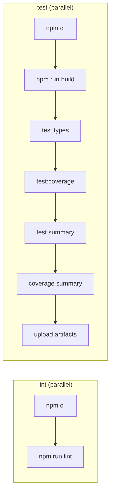

<!-- generated-by: gsd-doc-writer -->

# Configuration

This document covers all configurable aspects of the `@mikaelkaron/skills` monorepo, including TypeScript compiler options, linting, formatting, coverage, oclif CLI settings, semantic-release, and GitHub Actions workflows.

---

## TypeScript

### Root `tsconfig.json`

Located at the repository root. All package-level `tsconfig.json` files extend this via `"extends": "../../tsconfig.json"`.

| Option             | Value      | Notes                                    |
| ------------------ | ---------- | ---------------------------------------- |
| `target`           | `ES2022`   | Compilation target                       |
| `module`           | `NodeNext` | ESM with Node.js resolution              |
| `moduleResolution` | `NodeNext` | Matches `module` setting                 |
| `strict`           | `true`     | All strict type-checking flags enabled   |
| `skipLibCheck`     | `true`     | Skips type-checking of declaration files |
| `types`            | `["node"]` | Only Node.js globals injected            |

Project references (composite build):

```json
"references": [
  { "path": "packages/cherry-pick-filter" },
  { "path": "packages/tessl" }
]
```

Build all packages from the root:

```bash
npm run build
# equivalent: tsc -b
```

### `tsconfig.test.json`

Extends `tsconfig.json`. Used by `npm run test:types` to type-check test files without emitting output.

Additional options:

| Option                       | Value  |
| ---------------------------- | ------ |
| `allowImportingTsExtensions` | `true` |
| `noEmit`                     | `true` |

Includes: `packages/*/test/**/*.ts`, `test/**/*.ts`, `scripts/**/*.mts`

References: `packages/cherry-pick-filter`, `packages/tessl`.

### Per-package `tsconfig.json`

Each package under `packages/` extends the root config and sets `"composite": true` for project reference support.

| Package              | `rootDir` | `outDir` | `noEmit` |
| -------------------- | --------- | -------- | -------- |
| `cherry-pick-filter` | `src`     | `dist`   | —        |
| `tessl`              | `src`     | `dist`   | —        |

### Per-package `test/tsconfig.json`

Each package has a `test/tsconfig.json` for type-checking tests in isolation. Common settings:

| Option                       | Value   |
| ---------------------------- | ------- |
| `composite`                  | `false` |
| `rootDir`                    | `.`     |
| `allowImportingTsExtensions` | `true`  |
| `noEmit`                     | `true`  |

Each test tsconfig also declares a `references` entry pointing to `".."` (the parent package).

---

## Linting — oxlint

Config file: `oxlint.config.ts` (repository root)

```ts
import { defineConfig } from "oxlint";

export default defineConfig({
  rules: {},
});
```

No rules are overridden; oxlint runs with its default rule set. Run from the root:

```bash
npm run lint
# equivalent: oxlint .
```

Lint is enforced in CI on every push to `main` and every pull request (see [GitHub Actions — CI](#github-actions--ci)).

---

## Formatting — oxfmt

Config file: `oxfmt.config.ts` (repository root)

| Option           | Value              |
| ---------------- | ------------------ |
| `printWidth`     | `80`               |
| `tabWidth`       | `2`                |
| `useTabs`        | `false`            |
| `semi`           | `true`             |
| `singleQuote`    | `false`            |
| `trailingComma`  | `"all"`            |
| `ignorePatterns` | `["CHANGELOG.md"]` |

Run from the root:

```bash
npm run format
# equivalent: oxfmt .
```

Formatting is not enforced as a separate CI step; lint covers style compliance.

---

## Coverage — c8

c8 is invoked directly in the root `test:coverage` script. There is no dedicated `.c8rc` or `c8` config block in `package.json`; all options are passed inline:

```bash
c8 \
  --reporter=text \
  --reporter=json-summary \
  --reporter=lcov \
  node --experimental-strip-types --test \
    --test-reporter=spec --test-reporter-destination=stdout \
    --test-reporter=./scripts/reporters/test.mts --test-reporter-destination=test-results.ndjson \
    'packages/*/test/**/*.test.ts' 'test/**/*.test.ts'
```

| Reporter       | Output                           |
| -------------- | -------------------------------- |
| `text`         | Console summary                  |
| `json-summary` | `coverage/coverage-summary.json` |
| `lcov`         | `coverage/lcov.info`             |

No minimum coverage thresholds are configured. The CI job uploads `test-results.ndjson` as an artifact named `test-results` and the entire `coverage/` directory as an artifact named `coverage`.

---

## oclif CLI

### Root package

`oclif` block in `package.json`:

| Key            | Value                                                                                | Description                                  |
| -------------- | ------------------------------------------------------------------------------------ | -------------------------------------------- |
| `bin`          | `mks`                                                                                | CLI binary name                              |
| `dirname`      | `mikaelkaron/skills`                                                                 | oclif data directory under the OS config dir |
| `pluginPrefix` | `skills`                                                                             | Prefix for discoverable plugins              |
| `scope`        | `mikaelkaron`                                                                        | npm scope for plugin resolution              |
| `plugins`      | `["@oclif/plugin-autocomplete", "@oclif/plugin-not-found", "@oclif/plugin-plugins"]` | Bundled plugins loaded at startup            |

### `packages/cherry-pick-filter`

| Key                     | Value                    |
| ----------------------- | ------------------------ |
| `bin`                   | `mks-cherry-pick-filter` |
| `id`                    | `cherry-pick-filter`     |
| `commands.strategy`     | `pattern`                |
| `commands.target`       | `./dist/commands`        |
| `commands.globPatterns` | `["**/*.js"]`            |

### `packages/tessl`

| Key                        | Value                                               |
| -------------------------- | --------------------------------------------------- |
| `bin`                      | `mks-tessl`                                         |
| `id`                       | `tessl`                                             |
| `commands.strategy`        | `pattern`                                           |
| `commands.target`          | `./dist/commands`                                   |
| `commands.globPatterns`    | `["**/*.js"]`                                       |
| `topics.tessl.description` | `"Manage tessl skill tiles for installed plugins."` |

---

## Tessl tiles

Each package that ships a skill tile carries a `tessl` block in its `package.json` and a `tile.json` in its corresponding `skills/<package>/` directory.

| Package                      | Tile name                        | Tile version |
| ---------------------------- | -------------------------------- | ------------ |
| root (`@mikaelkaron/skills`) | `mikaelkaron/cli`                | `0.4.0`      |
| `cherry-pick-filter`         | `mikaelkaron/cherry-pick-filter` | `0.3.0`      |
| `tessl`                      | `mikaelkaron/tessl`              | `0.4.0`      |

The tile version in `package.json` (`tessl.version`) and `skills/<package>/tile.json` (`version`) must be kept in sync manually when the tile definition changes.

---

## Semantic-release — `release.config.mjs`

### Release branches

| Branch  | Channel   | Prerelease tag |
| ------- | --------- | -------------- |
| `main`  | (default) | —              |
| `pre`   | `pre`     | `pre`          |
| `alpha` | `alpha`   | `alpha`        |
| `beta`  | `beta`    | `beta`         |
| `rc`    | `rc`      | `rc`           |

Tag format: `v${version}`

### Plugin pipeline

Plugins run in this order during a release. Each step has an ID used by `SEMREL_SKIP_STEPS` (see [Environment variables](#environment-variables)):

| Step ID                                             | Plugin                                      | Action                                                                                |
| --------------------------------------------------- | ------------------------------------------- | ------------------------------------------------------------------------------------- |
| _(no ID)_                                           | `@semantic-release/commit-analyzer`         | Determine next version                                                                |
| _(no ID)_                                           | `@semantic-release/release-notes-generator` | Generate release notes                                                                |
| `@semantic-release/changelog`                       | `@semantic-release/changelog`               | Update `CHANGELOG.md`                                                                 |
| `@semantic-release/exec:install`                    | `@semantic-release/exec`                    | `npm ci && mkdir -p dist/releases`                                                    |
| `@semantic-release/exec:set-workspace-versions`     | `@semantic-release/exec`                    | `node scripts/set-workspace-versions.mjs ${nextRelease.version}`                      |
| `@semantic-release/exec:update-lockfile`            | `@semantic-release/exec`                    | `npm install --package-lock-only`                                                     |
| `@semantic-release/exec:build`                      | `@semantic-release/exec`                    | `npm run build`                                                                       |
| `@semantic-release/npm:.`                           | `@semantic-release/npm`                     | Publish root package, tarball → `dist/releases`                                       |
| `@semantic-release/npm:packages/cherry-pick-filter` | `@semantic-release/npm`                     | Publish `packages/cherry-pick-filter`, tarball → `dist/releases`                      |
| `@semantic-release/npm:packages/tessl`              | `@semantic-release/npm`                     | Publish `packages/tessl`, tarball → `dist/releases`                                   |
| `@semantic-release/git`                             | `@semantic-release/git`                     | Commit `CHANGELOG.md`, `package.json`, `package-lock.json`, `packages/*/package.json` |
| `@semantic-release/github`                          | `@semantic-release/github`                  | Create GitHub release                                                                 |

The `@semantic-release/git` commit message template:

```
chore(release): ${nextRelease.version}

${nextRelease.notes}

[skip ci]
```

---

## Environment variables

### Release workflow

| Variable            | Where set                     | Description                                                     |
| ------------------- | ----------------------------- | --------------------------------------------------------------- |
| `GITHUB_TOKEN`      | `secrets.GITHUB_TOKEN` (auto) | GitHub API access for `@semantic-release/github`                |
| `NPM_TOKEN`         | `secrets.NPM_TOKEN`           | npm publish token for all packages                              |
| `SEMREL_SKIP_STEPS` | Assembled by `setup` job      | Pipe-separated list of step IDs to skip in the release pipeline |

### Publish Tile workflow

| Variable          | Where set                 | Description                                                                                                                                                |
| ----------------- | ------------------------- | ---------------------------------------------------------------------------------------------------------------------------------------------------------- |
| `TESSL_API_TOKEN` | `secrets.TESSL_API_TOKEN` | Authentication token passed to `tesslio/setup-tessl` for tessl CLI authentication <!-- VERIFY: token scope and expiry requirements for TESSL_API_TOKEN --> |

### Scripts (CI summaries)

| Variable              | Used in                                                    | Description                                                                                         |
| --------------------- | ---------------------------------------------------------- | --------------------------------------------------------------------------------------------------- |
| `GITHUB_STEP_SUMMARY` | `scripts/coverage-summary.mts`, `scripts/test-summary.mts` | Path to the GitHub Actions step summary file; output is written there when set, otherwise to stdout |

---

## GitHub Actions workflows

### CI (`ci.yml`)

Trigger: push to `main`, any pull request, `workflow_dispatch`.



### Release (`release.yml`)

Trigger: `workflow_dispatch` only. Runs only on `main`, `pre`, `alpha`, `beta`, or branches matching `rc*`.

Workflow dispatch inputs allow individual semantic-release steps to be skipped by setting the corresponding boolean input to `true`. The `setup` job assembles the skipped step IDs into `SEMREL_SKIP_STEPS` and passes them to the `release` job.

Required secrets: `NPM_TOKEN`, `GITHUB_TOKEN`.

### Publish Tile (`publish-tile.yml`)

Trigger: `workflow_dispatch` only. Select one or more packages via boolean inputs (`cherry-pick-filter`, `cli`, `tessl`).

The `setup` job builds a matrix of selected tile directories under `skills/`. Each selected package's tile directory is then published in parallel using the tessl CLI (`tessl tile publish .`). Authentication is handled by the `tesslio/setup-tessl@v2` action using OIDC (`id-token: write`).

Required secret: `TESSL_API_TOKEN`.

---

## Node.js version requirement

All packages and the root require Node.js `>=22.18`. CI runs Node.js `24`.

```json
"engines": {
  "node": ">=22.18"
}
```
